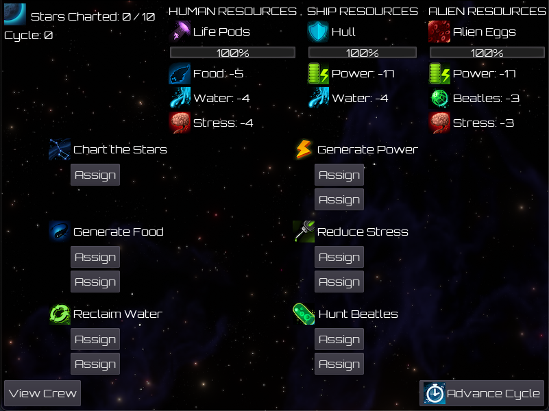
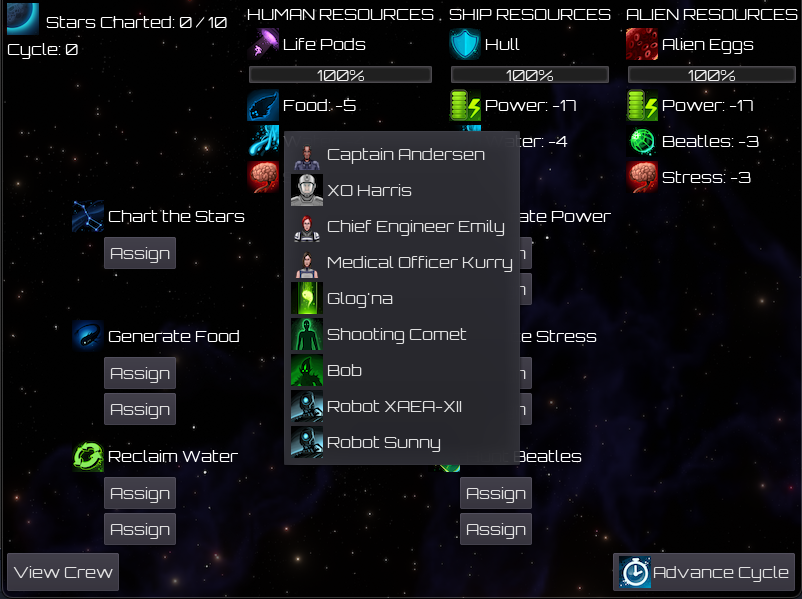
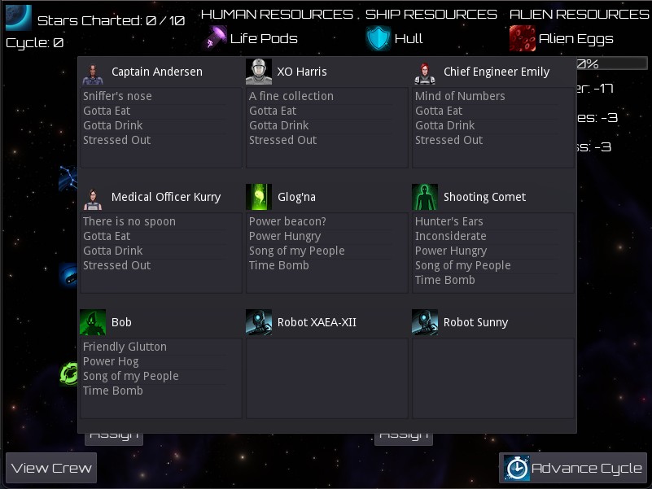
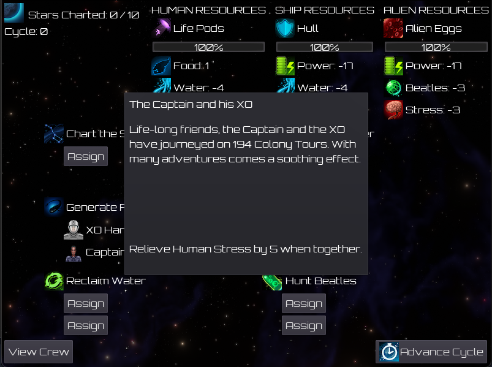

# Chart the Stars - GMTK 2021 Game Jam Submission

This is my submission for the 2021 GMTK Game Jam, themed "Joined Together".

You can play this game on [itch](https://lafferty.itch.io/chart-the-stars) from your browser. You can also view the [GMTK 2021 Page](https://itch.io/jam/gmtk-2021/rate/1084587).

## Screenshots

## Timeline

The Game Jam ran from 2021-06-11 at 1:00PM CDT to 2021-06-13 at 1:20PM CDT (allowing for late submissions due to heavy jamming at the end).

I spent just about 35 hours on this project (including breaks). This was an incredibly intense Game Jam because I wanted to finish with something better than what I had. My drive to see my vision to completion really drove me to work very hard on this.

2021-06-11:
* 3 hours of preperation work before the Game Jam started, spent scaffolding the project and sorting basic Assets
* 3 hours on initial design and scoping
* 8 hours on pure Development

2021-06-12:
* 1 hour of iteration design and scoping
* 16 hours of intense development (not including a 2 hour break for exercise, dinner, and meeting up with Friends)

2021-06-13:
* 4 hours of intense iteration and development

## Retrospective

* Visuals: 3/5
    * The icons ended up looking great! Lots of improvements could be done to spiff up the UI.
* UX: 2/5
    * This is probably where I iterated the most. Overall I think the UX is very clunky, difficult to grasp, and disconnected.
* Sound: na/5
    * I did not have enough time to add music or sound cues, but desired to do so.
* Gameplay: 2/5
    * Disconnected, but the parts that work I think work well. The `Trait Pair` system when two people work the same Job I think worked out very well.

I'm quite please with what I got done, but disappointed in the result. The amount of UI work and interconnectedness in the program was intense. Building an entire game out of a UI was more challenging than I expected.

It was fun seeing the assets start to come together. Going from "programmer art" to "final art" transformed the experience. Before the art was in, my game wasn't very well understood. Lots of text and not a whole lot of polish.

Iterating on the UI is expensive in terms of time. While the end result is significantly better, my own lack of design experience cost me a significant amount of refactoring time.

The initial scope ended up being too large.... unsurprising. I did not leave enough time for polishing and improving the "game"; even after cutting scope. I feel I had a good handle on how my time *should* be divided. I ended up underestimating the amount of work it would be to wire up complex individuals with unique interactions. I needed an engine that took People, Traits, Jobs, Races, and Resources and compute the output from there.

I don't mind the general design patterns I implemented during the Jam. Sure, its not perfect, but its done. I'm particularly happy with how `Traits` and `Trait Pairs` ended up working, and very unhappy with how the `Job` system was implemented and how it links with `Resources`. I'm not convinced that pre-designing this would have been beneficial.

I vastly underestimated the amount of creative energy bespoke scripting takes. I was exhausted with just 28 unique permutations! This zapped other creative energy from me. My technical writing and creative writing muscles are relatively poor. Having someone cross-reference these was a good thing.

My game balancing intuition is also poor. I threw numbers together and was hoping that they would all shake out at the end. I'm not sure how to get better at this.

At the last minute, I fixed an issue where some of my `png` files had an extension of `PNG`. Unfortunately, for case-sensitive systems, this caused there to be a very unnoticeable issue where the scene could not be loaded. This caused me to miss shipping Mac, Linux, and Windows builds into the submission (but got them in 15 minutes after the deadline). I'm not entirely sure what the takeaway here is, besides that every change can have unintended consequences.

I took very detailed notes on how my time was spent the weekend of the Jam. I think that was a very good experience. In the moment I could trivially see when I was "in-the-flow" or if I was spinning on something not particularly useful.

### YoY Improvements

* This game is better than [Sky High](https://github.com/LaffertyDev/SkyHigh)
* I still suffer from the [The Gap](https://vimeo.com/85040589)
* My UI programming skills have increased significantly, but still not to my Taste
* My gameplay programming Skills have increased significantly

### Thoughts for Future Jams

* Continue to prep for the Jam (Project, Assets). This saves an immense amount of time.
* Use tools you are comfortable with. Learning new things is time away from implementing.
* Spend more time on the initial design and architecture
    * Thinking through systems is difficult. But ultimately I think that's where my game suffered the most
* Export and test your game often. Keep those exports as lock-steps in case something cataclysmic happens
* For every hour spent on initial development, plan for an hour spent iterating
* Plan for one hour of creating writing for the submission. Try to do this away from the Deadline so you're not crunched for iteration time.
* Consider how the Game Mechanics will be learned. Tutorials? Text? Self-evident? Limited time makes this very difficult.
* HTML Builds are Essential to discoverability
* Gifs showing Gameplay are Esssential to discoverability

(Budgeting, out of 48 hours, 16 hours spent sleeping, 3 spent eating, 2 spent breaking, for 27 hours of total project time)
I propose a breakdown of time for future Jams:
* 1 hour brainstorming of ideas
* 2 hours of asset management (finding, curator, mixing, inserting)
* 2 hours of initial design
* 1 hour of creating submission writing
* 1 hour of creating the submission
* 10 hours of initial development
* 10 hours of development iteration and testing

Significant care must be taken not to "Steal" time from "Iteration" to justify more Development.

## Credits

Jordan, for initial brainstorming and mockups

Emily, for helping improve the UX Design and Structure. For creating me several assets that ended up in the final product.

## Assets

https://www.kenney.nl/assets/sci-fi-sounds

https://www.kenney.nl/assets/interface-sounds

https://www.kenney.nl/assets/ui-audio

https://www.kenney.nl/assets/simple-space

https://www.kenney.nl/assets/ui-pack-space-expansion

https://www.kenney.nl/assets/ui-pack

https://opengameart.org/content/20-planet-sprites

https://opengameart.org/content/vegastrike-portraits

https://opengameart.org/content/3-layer-parallax-star-and-nebula-field

https://fonts.google.com/specimen/Orbitron